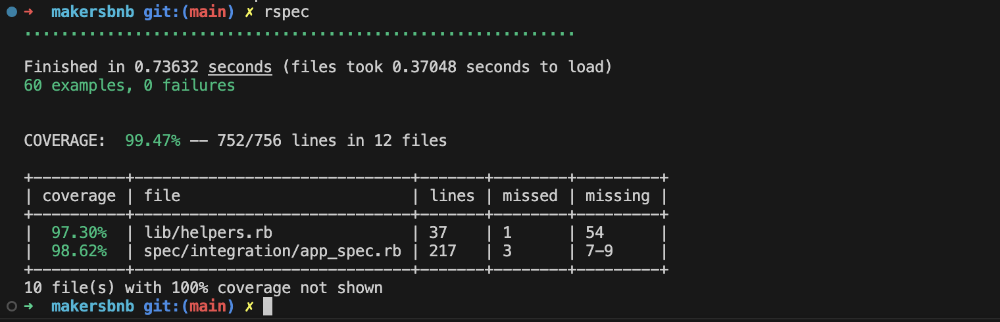

# MakersBnB Project

This repo contains the codebase for the MakersBnB project in Ruby (using Sinatra and RSpec).

This was the first team engineering project I undertook as part of the Makers Academy software engineering bootcamp. We worked in a team of 5 over 5 days.


## Setup

```bash
git clone https://github.com/tomcarmichael/makersbnb.git

# Install gems
bundle install

# Create local databases
createdb makersbnb
createdb makersbnb_test

# Seed the databases
psql -h 127.0.0.1 makersbnb < ./spec/seeds/create_tables.sql
psql -h 127.0.0.1 makersbnb_test < ./spec/seeds/create_tables.sql
psql -h 127.0.0.1 makersbnb < ./spec/seeds/seeds.sql
psql -h 127.0.0.1 makersbnb_test < ./spec/seeds/seeds.sql

# Run the tests
rspec

# Run the server (better to do this in a separate terminal).
rackup
```

Visit the website in your browser at `localhost:9292` 

Log in to the website with email: `tom@email.com`, password: `tompassword`

You can now view listed spaces and click on a listing to see its own page where you can request to book from a range of available dates. On the `/requests` page, you can view requests that you have made, as well as requests for spaces that you own. 

A new space can be listed on the homepage at `/`.

Test coverage: 99.47% 


# Project specification

We were given the following specification as a starting point:

We would like a web application that allows users to list spaces they have available, and to hire spaces for the night.

### Headline specifications

- Any signed-up user can list a new space.
- Users can list multiple spaces.
- Users should be able to name their space, provide a short description of the space, and a price per night.
- Users should be able to offer a range of dates where their space is available.
- Any signed-up user can request to hire any space for one night, and this should be approved by the user that owns that space.
- Nights for which a space has already been booked should not be available for users to book that space.
- Until a user has confirmed a booking request, that space can still be booked for that night.

### Nice-to-haves

- Users should receive an email whenever one of the following happens:
  - They sign up
  - They create a space
  - They update a space
  - A user requests to book their space
  - They confirm a request
  - They request to book a space
  - Their request to book a space is confirmed
  - Their request to book a space is denied
- Users should receive a text message to a provided number whenever one of the following happens:
  - A user requests to book their space
  - Their request to book a space is confirmed
  - Their request to book a space is denied
- A ‘chat’ functionality once a space has been booked, allowing users whose space-booking request has been confirmed to chat with the user that owns that space
- Basic payment implementation though Stripe.

### Mockups

Mockups for MakersBnB are available [here](./MakersBnB_mockups.pdf).